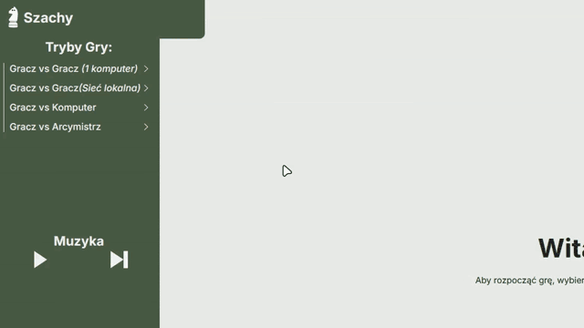
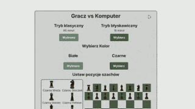
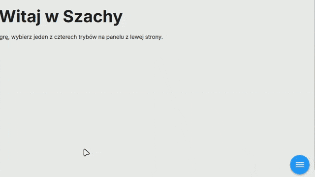
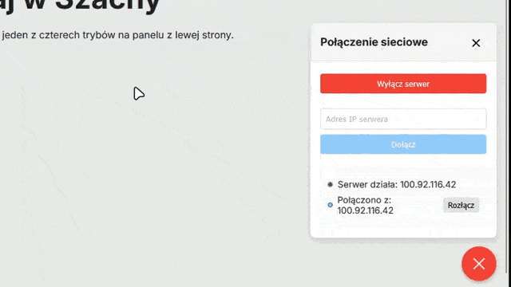
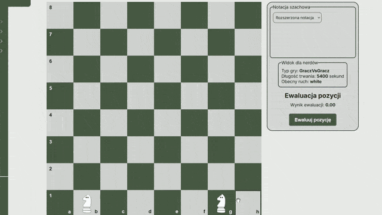

# Szachy

## Opis projektu
Nasza gra "Szachy" to implementacja gry w szachy przeznaczona do uruchamiania w przeglądarce. Gra umożliwia rozgrywkę w różnych trybach, w tym w sieci lokalnej oraz przeciwko komputerowi wykorzystującemu algorytmy sztucznej inteligencji.

---

## Uruchamianie projektu

### Wymagania systemowe
- Node.js (zalecana wersja: v22.14.0)
- Angular CLI (wymagana wersja >19.2.3)

### Instalacja
1. Pobierz projekt `https://github.com/UnknownUser18/szachy-ale-mi-sie-udalo.git`.
2. Przejdź do katalogu głównego (tam, gdzie znajduje się `package.json`).
   ```
   cd ./szachy
   ```
3. Zainstaluj wymagane zależności:
    ```
    npm i
    npm install -g @angular/cli
    ```
4. Uruchom kompilację projektu:
    ```
    npm run build
    ```
5. Uruchom serwer aplikacji:
    ```
    npm start 
    ```
6. W osobnym terminalu zainicjuj kontroler serwera
    ```
    node ./backend/controller.js
    ```
---
## Opis funkcjonalności

Sekcja ta opisuje różnorodne możliwości aplikacji szachowej, która umożliwia grę w różnych trybach i zawiera zaawansowane mechanizmy analizy ruchów.

### Panel główny menu
Po uruchomieniu aplikacji użytkownik przenoszony jest do panelu głównego, który zawiera:
- **Wybór trybu gry** – cztery różne tryby rozgrywki. 
- **Muzyka** - możliwość słuchania, zatrzymania, zmiany głośności oraz zmiany utworu.

### Tryby gry

1. **Gracz vs Gracz (na jednym komputerze)**  
   Gra dla dwóch osób przy jednym urządzeniu. Gracze wykonują ruchy naprzemiennie.

2. **Gracz vs Gracz (w sieci lokalnej)**  
   Rozgrywka odbywa się w sieci lokalnej **(LAN)**. Jeden z graczy hostuje grę, a drugi dołącza do niego.

   Aby stworzyć serwer: <br>
   

   Natomiast aby dołączyć do serwera: <br>
   

4. **Gracz vs AI**  
   W tym trybie gracz rywalizuje z komputerem, który korzysta z algorytmu **MiniMax z Alfa-Beta Pruning**. AI ocenia możliwe ruchy, przewidując najlepszą strategię, a dzięki Alfa-Beta Pruning optymalizuje analizę, przyspieszając decyzje. Gracz może wybrać poziom trudności, od początkującego po zaawansowany, co zapewnia dynamiczną i wymagającą rozgrywkę.

5. **Gracz vs Arcymistrz**  
   Tryb dla zaawansowanych graczy. Sztuczna inteligencja korzysta z bazy partii szachowych w formacie **.pgn**, symulując poziom gry arcymistrzów. Użytkownik może także użyć własne pliki **.pgn**, co umożliwia personalizację rozgrywki.
#### Każdy tryb zawiera

- notację szachową
- ewaluacje pozycji
- podpowiedzi (możliwe do właczenia)
- widok dla nerdów

### Rozgrywka


Aplikacja zapewnia pełną analizę i weryfikację dostępnych ruchów, dbając o zgodność z zasadami szachowymi.


### Funkcjonalności interfejsu

- **Podpowiedzi ruchów**  
  Kliknięcie na figurę podświetla wszystkie dostępne pola, na które można się nią ruszyć, uwzględniając:
    - Możliwość zbicia innej figury.
    - Ograniczenia wynikające z reguł (np. nielegalny ruch króla do pola szacha).

- **Blokowanie niedozwolonych ruchów**  
  Aplikacja automatycznie uniemożliwia wykonanie ruchu niezgodnego z zasadami gry.

- **Wsparcie dla zaawansowanych reguł**  
  Mechanizm gry uwzględnia między innymi:
    - **En passant** – automatyczna detekcja i umożliwienie wykonania tego specyficznego ruchu.
    - **Roque (roszada)** – aplikacja sprawdza możliwość wykonania krótkiej lub długiej roszady.
    - **Promocja pionka** – po dotarciu do ostatniej linii gracz ma możliwość wyboru figury, na którą pionek zostaje zamieniony.

- **Analiza stanu gry**

   <br>
  Aplikacja monitoruje sytuację na planszy, informując gracza o:
    - Szachu.
    - Patowej sytuacji.
    - Matowaniu przeciwnika.
    - Remisie.

- **Ewaluacja Pozycji**  
  Interfejs zawiera dynamiczny wskaźnik oceny pozycji w formie termometru, który przedstawia przewagę jednej ze stron w oparciu o aktualne parametry pozycji.
  Skala zmienia się w czasie rzeczywistym po każdym ruchu.

- **Tryb dla nerdów**  
  Specjalny tryb wyświetlający dodatkowe dane analityczne, takie jak:
    - Typ gry
    - Długość trwania gry
    - Obecny ruch
    - Poziom trudności AI
    - Nazwa pliku PGN
    - Kto wykonuje ruch
    - Kolor danego gracza
    - Następne ruchy gracza i arcymistrza

---

## Notacja szachowa

W trakcie rozgrywki aplikacja wyświetla zapis partii w **notacji algebraicznej** (zarówno krótkiej, jak i długiej).

**Przykłady:**
- **Notacja krótka**: `e4 e5 Nf3 Nc6 Bb5`
- **Notacja długa**: `Re2-e4 e7-e5 Ng1-f3 b8-c6 f1-b5`

---

## Struktura Plików


### Opis folderów i plików:

```
backend // folder obsługujący tryb gry Gracz vs Gracz w sieci
| - controler.js - obsługa tworzenia oraz usuwanie hosta (serwera)
| - index.js - sam serwer (wywoływany przez controller.js) 
| - package-lock.json - paczki node
| - package.json - paczki node
szachy // frontend oraz cała logika szachów
| - .vscode - pliki Visual Studio Code (niewazne dla projektu)
| - public // Plik favicon.svg
|   | - favicon.svg - plik dla ikonki strony
| - src
| - public  // Pliki dostępne publicznie (obrazy, czcionki, ikony)
| - src  // Główny folder zawierający kod źródłowy
|   | - app  // Główna część aplikacji – komponenty i logika interfejsu użytkownika
|	|	| - game-end-dialog // Komponent odpowiedzialny za koniec gry
|	|	| - game-invite-dialog // Komponent odpowiedzialny za wyzywania gracza w sieci do gry
|   |	| - game-selector  // Komponent umożliwiający wybór trybu gry
|   |	| - menu  // Komponent wyświetlający główne menu aplikacji
|	|	| - nerd-view // Komponent wyświetlający widok dla nerda
|	|	| - notation // Komponent wyświetlający notację szachową
|	|	| - pawn-promotion  // Komponent odpowiedzialny za promocję pionka
|	|	| - podpowiedzi // Komponent odpowiedzialny za podpowiedzi użytkownika w partii
|	|	| - position-evaluator // Komponent odpowiedzialny za ewaluacje pozycji w partii
|	|	| - szachownica  // Komponent reprezentujący planszę szachową
|	|	| - ustawienia // Komponent odpowiedzialny za motyw na stronie
|	|	| - zegar  // Komponent do śledzenia czasu gry
|   | - assets  // Pliki statyczne (obrazy, dźwięki, czcionki)
|   | - enviroments // ustawia port do serwera
gify // folder przechowujący gify przedstawiające działanie oprogramowania
```

## Strategia testów:

Strategia testów znajduję się w [tym linku](strategia_testow.md).

## Pamiętniki:

Dawid W. - [`dawid_pamietnik.md`](dawid_pamietnik.md) <br>
Michał W. - [`michal_pamietnik.md`](michal_pamietnik.md) <br>
Aleksander K. - [`pamietnik_olo.md`](pamietnik_olo.md) <br>
Kuba Ć. - [`jakub_pamietnik.md`](jakub_pamietnik.md) <br>
Szymon Ż -
